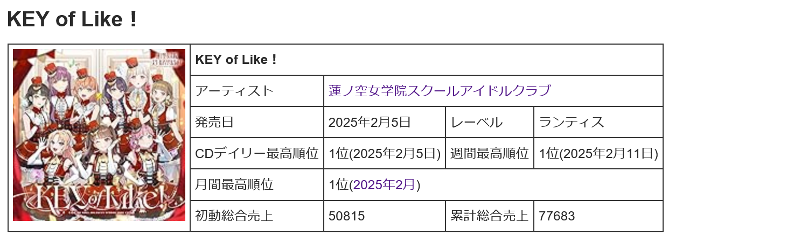
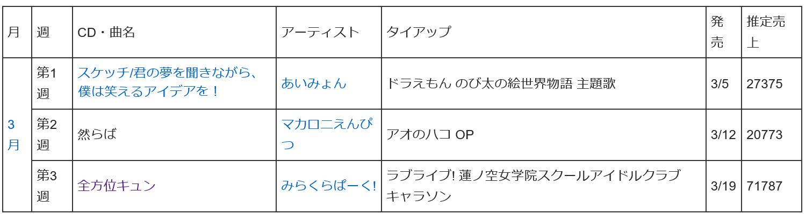
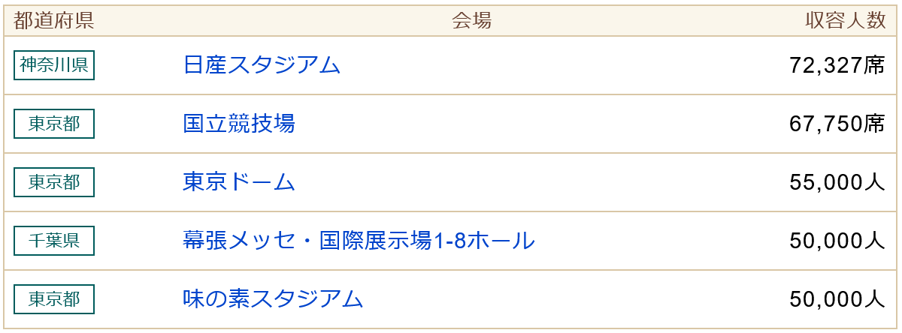
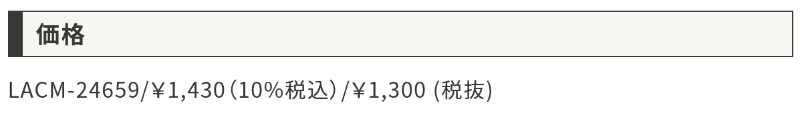
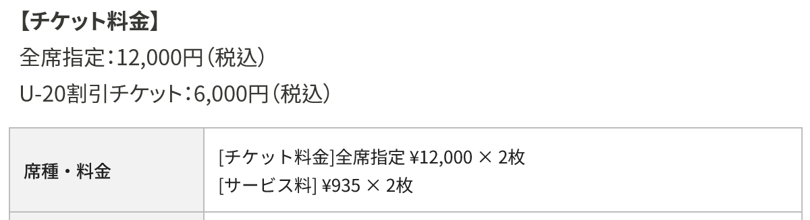

# Ticket Decision Analysis

參考 [本篇文章](https://github.com/BennyNTHU/Ticket/blob/main/Tickets.pdf) 完成的網頁版程式，使用 javascript 完全重構。  
使用者可以輸入不同數值，探討不同場次的中獎機率、最佳效益投資比以及納許均衡解。

[網頁連結](https://tda.canaria.cc/)

## 使用說明

### CD 累計総合売上

綑綁販售抽選券的 CD 累計綜合銷量。  
可以在 [這個網站](https://w.atwiki.jp/keroro00innovator/) 上搜尋，或使用 Google 或 Twitter 等工具搜尋銷量資料。  

若剛發售不到一週，則可以填入 **推定売上** ，或是填入 **初動売上** x 1.5 。  

### Live 會場座席數

舉辦 Live 的會場座席數量。  
可以在 [這個網站](https://www.livebu.com/search?p=1) 上搜尋，或使用 Google 或 Twitter 等工具搜尋會場的座席數量。  
(每個場次的座席數可能略有變化，請以官方公布的為準)  

### 每張 CD 價格

每張 CD 的售價，請輸入税込價格。  

### Live 票價成本

每場 Live 的票價，請自行加上售票平台的手續費。  

### 最大 CD 購買張數

預設為 100，建議值為 40 ~ 120。

## 結果判讀

請參考 [原文](https://github.com/BennyNTHU/Ticket/blob/main/Tickets.pdf) 說明。

## Credits

[https://github.com/BennyNTHU/Ticket](https://github.com/BennyNTHU/Ticket)  
[https://www.chartjs.org/](https://www.chartjs.org/)  